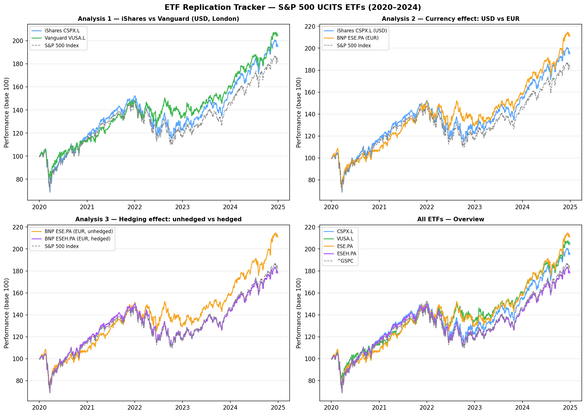
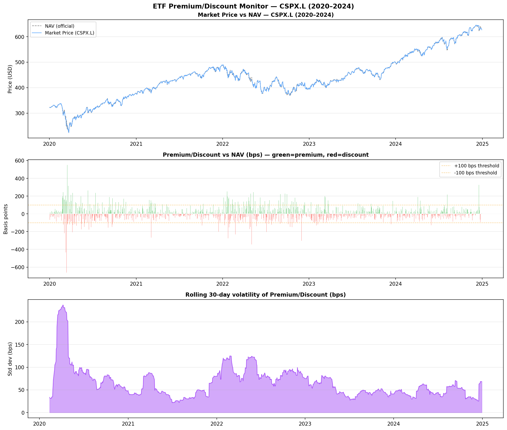

# ETF Research — S&P 500 UCITS Analysis

A series of quantitative analyses on S&P 500 UCITS ETFs, covering replication
quality, currency effects, and hedging costs. Built from a market making and
ETF issuance perspective.

---

## 1. ETF Replication Tracker

**Notebook**: `replication-tracker/etf_replication.ipynb`

Compares how four S&P 500 UCITS ETFs replicate their benchmark across different
issuers, currencies, and exchanges.

### ETFs Analysed

| Ticker | Issuer | Currency | Exchange | Type |
|---|---|---|---|---|
| CSPX.L | iShares | USD | London | Physical full replication |
| VUSA.L | Vanguard | USD | London | Physical optimised |
| ESE.PA | BNP Paribas | EUR | Paris | Physical, unhedged |
| ESEH.PA | BNP Paribas | EUR | Paris | Physical, EUR/USD hedged |

### Results

**Analysis 1 — Replication quality: iShares vs Vanguard**

| ETF | Ann. Return | vs Index | Corr (vs peer) |
|---|---|---|---|
| iShares CSPX.L | 14.65% | +1.67% | 0.87 |
| Vanguard VUSA.L | 15.77% | +2.79% | 0.87 |
| S&P 500 (^GSPC) | 12.98% | — | — |

**Analysis 2 — Currency effect: USD vs EUR unhedged**

| ETF | Ann. Return | vs Index |
|---|---|---|
| iShares CSPX.L (USD) | 14.65% | +1.67% |
| BNP ESE.PA (EUR) | 16.53% | +3.55% |

→ EUR/USD currency effect: **+1.87%/year** over 2020–2024

**Analysis 3 — Hedging effect**

| ETF | Ann. Return |
|---|---|
| BNP ESE.PA (EUR, unhedged) | 16.53% |
| BNP ESEH.PA (EUR, hedged) | 12.55% |

→ Cost of hedging: **-3.98%/year** — EUR investor paid to remove FX exposure



### Key Findings

- Both iShares and Vanguard outperform the price return index — explained by
  **dividend reinvestment** and **securities lending income**
- The **+1.87%/year currency effect** shows EUR investors in unhedged ETFs
  benefited from EUR appreciation vs USD over 2020–2024
- The **-3.98%/year hedging cost** reflects the interest rate differential
  between EUR and USD (higher USD rates = expensive to hedge for EUR investors)
- Daily correlation between London-listed ETFs and ^GSPC is ~0.62 — not a
  data issue, but a real market feature: **closing price risk**. London closes
  3.5 hours before New York, leaving European market makers exposed to residual
  US session moves hedged via S&P 500 futures (ES1)

## 2. ETF Premium/Discount Monitor

**Notebook**: `premium-discount/etf_premium_discount.ipynb`

Analyses daily premium/discount of CSPX.L vs its official iShares NAV
(sourced directly from iShares.com — not a proxy).

### Results

| Metric | Value |
|---|---|
| Mean premium/discount | +1.85 bps |
| Std deviation | 73.27 bps |
| Max premium | +550.12 bps (16 Mar 2020) |
| Max discount | -662.09 bps (13 Mar 2020) |
| Days at premium | 48.1% |
| Days at discount | 51.9% |
| Stress days (>\|100 bps\|) | 145 days |

### Key Findings
- Near-zero mean (+1.85 bps) confirms efficient AP arbitrage mechanism
- Largest dislocations cluster around **Covid crash (Mar 2020)**,
  **Fed pivots (May/Nov 2022)**, and **FOMC surprises (Dec 2024)**
- Root cause of all major dislocations: **closing price risk** —
  London closes 3.5h before NYSE, leaving market makers exposed
  to residual US session moves hedged via S&P 500 futures (ES1)
- AP creation/redemption mechanism corrects dislocations at end of day,
  explaining the mean reversion to near zero over time



### Methodology Note

All closing prices from `yfinance`. Cross-exchange correlations are affected
by timezone differences (London close: 17:30 UK / NYSE close: 21:00 UK).
Monthly returns used for tracking error calculations to reduce this noise.
This reflects real conditions faced by ETF market makers in Europe.

---

## Stack

Python · pandas · numpy · matplotlib · yfinance · Jupyter

## Run it
```bash
pip install pandas numpy matplotlib yfinance jupyter
jupyter notebook replication-tracker/etf_replication.ipynb
jupyter notebook premium-discount/etf_premium_discount.ipynb
```