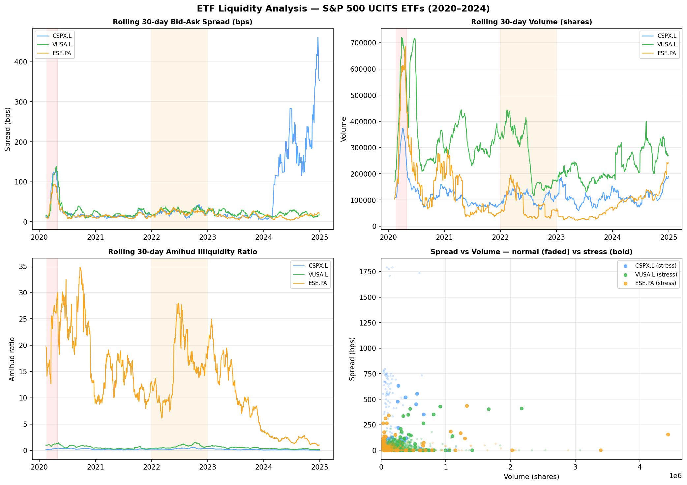
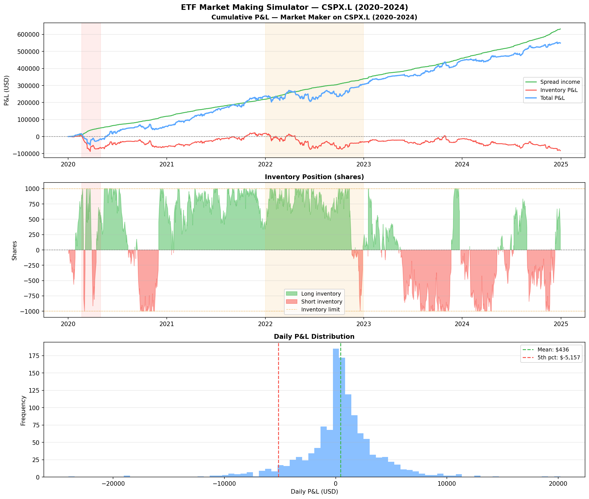

# ETF Research — S&P 500 UCITS Analysis

Quantitative analyses on S&P 500 UCITS ETFs covering replication quality,
currency effects, hedging costs, premium/discount dynamics, liquidity, and
market making simulation. Built from a market making and ETF issuance perspective.

---

## 1. ETF Replication Tracker
**Notebook**: `replication-tracker/etf_replication.ipynb`

Compares how four S&P 500 UCITS ETFs replicate the S&P 500 across different
issuers, currencies, and exchanges — with three distinct analyses.

| Ticker | Issuer | Currency | Exchange | Type |
|---|---|---|---|---|
| CSPX.L | iShares | USD | London | Physical full replication |
| VUSA.L | Vanguard | USD | London | Physical optimised |
| ESE.PA | BNP Paribas | EUR | Paris | Physical, unhedged |
| ESEH.PA | BNP Paribas | EUR | Paris | Physical, EUR/USD hedged |

### Analysis 1 — Replication quality: iShares vs Vanguard

| ETF | Ann. Return | vs Index | Corr (vs peer) |
|---|---|---|---|
| iShares CSPX.L | 14.65% | +1.67% | 0.87 |
| Vanguard VUSA.L | 15.77% | +2.79% | 0.87 |
| S&P 500 (^GSPC) | 12.98% | — | — |

Both ETFs outperform the raw index return — explained by **dividend reinvestment**
and **securities lending income** (ETFs lend holdings to short sellers, generating
additional revenue). The correlation of 0.87 between the two London-listed ETFs
(expected ~0.99 in theory) reflects **closing price risk** — see methodology note.

### Analysis 2 — Currency effect: USD vs EUR unhedged

| ETF | Ann. Return | vs Index |
|---|---|---|
| iShares CSPX.L (USD) | 14.65% | +1.67% |
| BNP ESE.PA (EUR) | 16.53% | +3.55% |

→ EUR/USD currency effect: **+1.87%/year** over 2020–2024.
ESE.PA is priced in EUR — outperformance reflects EUR appreciation vs USD over
this period. An EUR investor in an unhedged ETF is implicitly long USD.

### Analysis 3 — Hedging effect: unhedged vs hedged

| ETF | Ann. Return |
|---|---|
| BNP ESE.PA (EUR, unhedged) | 16.53% |
| BNP ESEH.PA (EUR, hedged) | 12.55% |

→ Cost of hedging: **-3.98%/year**. This reflects the **interest rate differential**
between EUR and USD — with higher USD rates (2020–2024), it is expensive for EUR
investors to hedge their USD exposure. The hedged return (12.55%) closely tracks
the pure index return (12.98%), confirming the hedge works as intended.

### Methodology note — Closing price risk
London closes 3.5 hours before New York. European ETF closing prices do not
reflect the full US session — introducing apparent noise in correlation and
tracking error metrics. This is not a data quality issue — it reflects a real
market risk faced daily by ETF issuers and market makers in Europe.
European market makers must hedge this residual exposure using S&P 500 futures
(ES1) after the London close. Monthly returns are used for tracking error
calculations to reduce this noise.


---

## 2. ETF Premium/Discount Monitor
**Notebook**: `premium-discount/etf_premium_discount.ipynb`

Analyses daily premium/discount of CSPX.L vs its **official iShares NAV**
(sourced directly from iShares.com — not a proxy or estimator).

| Metric | Value |
|---|---|
| Mean premium/discount | +1.85 bps |
| Std deviation | 73.27 bps |
| Max premium | +550.12 bps (16 Mar 2020) |
| Max discount | -662.09 bps (13 Mar 2020) |
| Days at premium | 48.1% |
| Days at discount | 51.9% |
| Stress days (\|>100 bps\|) | 145 days |

### Normal market conditions
Near-zero mean (+1.85 bps) confirms that the **Authorised Participant (AP)
arbitrage mechanism** works efficiently. When CSPX.L trades at a premium,
APs buy the underlying basket and create new ETF shares — compressing the
premium back to zero. This creation/redemption mechanism is the structural
backbone of ETF efficiency.

### Stress events — Top 10 dislocations

| Date | P/D (bps) | Type | Event |
|---|---|---|---|
| 13 Mar 2020 | -662 | Discount | Covid crash |
| 16 Mar 2020 | +550 | Premium | Covid rebound |
| 10 Mar 2020 | -434 | Discount | Covid crash |
| 4 May 2022 | -342 | Discount | Fed +50 bps surprise |
| 18 Dec 2024 | +325 | Premium | Fed "higher for longer" |
| 20 Mar 2020 | +314 | Premium | Covid rebound |
| 30 Nov 2022 | -301 | Discount | Fed pivot speculation |
| 1 Dec 2021 | +301 | Premium | Omicron reversal |
| 24 Jan 2022 | -276 | Discount | Fed hawkish shift |
| 5 Mar 2021 | -266 | Discount | Rates spike |

All large dislocations share the same root cause: the **3.5-hour gap** between
London close (17:30 UK) and NYSE close (21:00 UK). During stress, market makers
cannot efficiently hedge their residual US exposure — causing temporary but
significant dislocations. The AP mechanism corrects these at end of day, which
is why the mean reverts to near zero over time.

A market maker seeing a +300 bps premium at London close cannot immediately
arb it away — the underlying basket is still trading in the US. The AP
mechanism corrects dislocations at end of day via creation/redemption.


---

## 3. ETF Liquidity Analysis
**Notebook**: `liquidity-analysis/etf_liquidity.ipynb`

Analyses bid-ask spreads, trading volumes, and price impact across three
S&P 500 UCITS ETFs using market microstructure methods.

**Methods:**
- **Corwin-Schultz (2012)** — infers bid-ask spread from daily High/Low price
  ratios without requiring tick data *(Journal of Finance, 2012)*
- **Amihud (2002)** — price impact per dollar traded; higher = less liquid

### Average liquidity (2020–2024)

| ETF | Avg Spread (bps) | Avg Volume | Amihud |
|---|---|---|---|
| iShares CSPX.L (London) | 53.57 | 116,644 | 0.23 |
| Vanguard VUSA.L (London) | 24.19 | 284,262 | 0.57 |
| BNP ESE.PA (Paris) | 17.72 | 112,670 | 13.02 |
| SPY (US benchmark) | 27.51 | 81,674,899 | 0.0003 |

### Liquidity during stress vs normal

| Period | CSPX.L | VUSA.L | ESE.PA |
|---|---|---|---|
| Covid crash (Feb–Apr 2020) | 86.90 bps | 94.27 bps | 69.10 bps |
| Fed hike cycle (2022) | 24.02 bps | 27.83 bps | 24.92 bps |
| Normal (2023) | 14.66 bps | 21.92 bps | 13.99 bps |

### Key Findings
- **SPY dominates**: 81M shares/day vs ~200K for European UCITS —
  European ETFs are liquid enough for institutions but cannot match US
- **ESE.PA paradox**: lowest spread (17 bps) but highest Amihud (13).
  Low volume at Paris means each trade moves the price more —
  the spread looks tight but the market is thin
- **Stress multiplier**: spreads widen 3–5x during Covid crash with
  volume spiking simultaneously — classic liquidity crisis pattern
- **Market maker behaviour**: wide spreads + high volume = market makers
  present but demanding compensation for **inventory risk**.
  Narrow spreads + low volume = quiet market, easy to hedge



---

## 4. Market Making Simulator
**Notebook**: `market-making-simulator/etf_market_making.ipynb`

Simulates a market maker on CSPX.L over 2020–2024.

### Model
- Quotes a **20 bps spread** (10 bps each side of mid)
- Earns half the spread on each trade
- Manages **inventory up to ±1,000 shares**
- Participates in **1% of daily volume**
- Total P&L = spread income + inventory P&L (price moves × inventory held)

### Results by market regime

| Period | Spread P&L | Inv P&L | Total P&L | Sharpe |
|---|---|---|---|---|
| Covid crash (2020) | $38,905 | -$66,629 | -$27,724 | -1.57 |
| Bull market (2021) | $99,487 | +$78,862 | $178,348 | 4.03 |
| Fed hike cycle (2022) | $119,120 | -$50,610 | $68,510 | 0.88 |
| Normal (2023) | $120,529 | +$18,278 | $138,807 | 3.64 |
| Bull (2024) | $171,655 | -$69,559 | $102,096 | 2.48 |
| **Total** | **$631,815** | **-$82,556** | **$549,259** | |

### Key Findings
Market making is **profitable on average but dangerous during crises**.
During Covid, spread income ($38K) was insufficient to cover inventory
losses (-$66K) as the market fell 30% in weeks — the only losing period
over 5 years.

The core risk is **adverse selection**: when prices move directionally,
the market maker accumulates inventory on the wrong side faster than
spread income can compensate.

Professional ETF market makers manage this via:
- Dynamic spread widening during volatile periods (linked to VIX)
- Continuous delta hedging via S&P 500 futures (ES1)
- Hard inventory limits and real-time risk monitoring
- Creation/redemption with the ETF issuer to reset inventory

### Model limitations
This is a simplified daily simulation. A real ETF market maker would use
intraday tick data, hedge inventory continuously, adjust spreads dynamically
based on volatility, and interact directly with the ETF issuer's
creation/redemption mechanism.



---

## Methodology Note

All closing prices from `yfinance`. NAV data sourced directly from iShares.com
(official daily NAV — not a proxy). Bid-ask spreads estimated using
Corwin-Schultz (2012). Cross-exchange correlations affected by timezone
differences (London 17:30 UK / NYSE 21:00 UK) — this reflects real conditions
faced by ETF market makers in Europe, not a data quality issue.

---

## Stack
Python · pandas · numpy · matplotlib · scipy · yfinance · Jupyter

## Run it
```bash
pip install pandas numpy matplotlib scipy yfinance jupyter
jupyter notebook replication-tracker/etf_replication.ipynb
jupyter notebook premium-discount/etf_premium_discount.ipynb
jupyter notebook liquidity-analysis/etf_liquidity.ipynb
jupyter notebook market-making-simulator/etf_market_making.ipynb
```